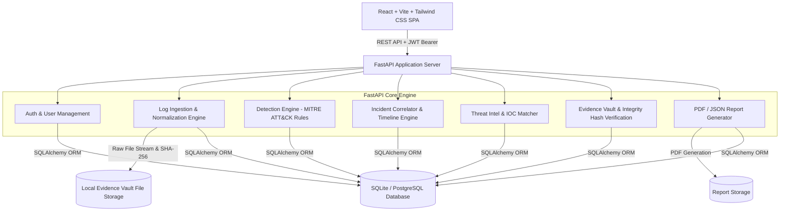
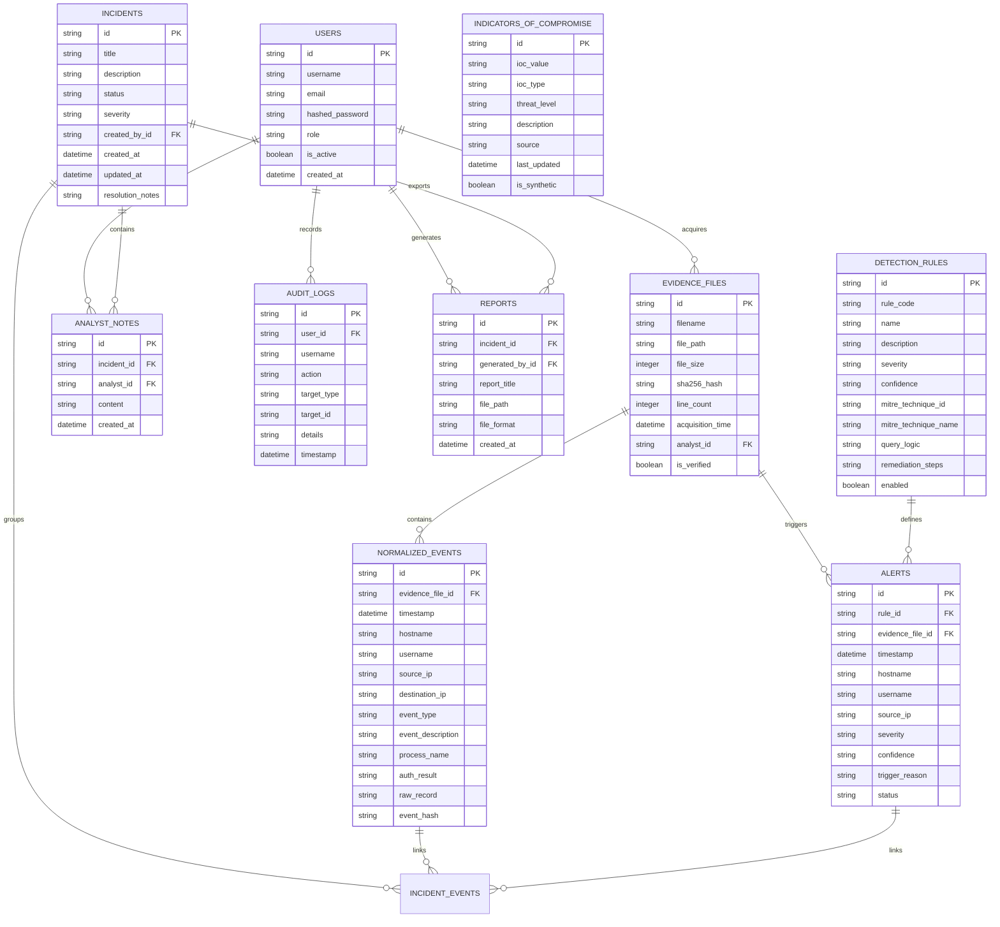

# TraceForensics Architecture & Data Model

## 1. System Architecture Diagram

```mermaid
graph TD
    Client[React + Vite + Tailwind CSS SPA] -->|REST API + JWT Bearer| FastAPI[FastAPI Application Server]
    
    subgraph FastAPI Core Engine
        Auth[Auth & User Management]
        Ingest[Log Ingestion & Normalization Engine]
        Detect[Detection Engine - MITRE ATT&CK Rules]
        Correlate[Incident Correlator & Timeline Engine]
        ThreatIntel[Threat Intel & IOC Matcher]
        Evidence[Evidence Vault & Integrity Hash Verification]
        Report[PDF / JSON Report Generator]
    end
    
    FastAPI --> Auth
    FastAPI --> Ingest
    FastAPI --> Detect
    FastAPI --> Correlate
    FastAPI --> ThreatIntel
    FastAPI --> Evidence
    FastAPI --> Report

    Ingest -->|Raw File Stream & SHA-256| VaultStorage[(Local Evidence Vault File Storage)]
    Report -->|PDF Generation| ReportStorage[(Report Storage)]
    
    Auth & Ingest & Detect & Correlate & ThreatIntel & Evidence & Report -->|SQLAlchemy ORM| DB[(SQLite / PostgreSQL Database)]
```

## 2. Database Entity-Relationship (ER) Diagram

```mermaid
erDiagram
    USERS ||--o{ EVIDENCE_FILES : acquires
    USERS ||--o{ ANALYST_NOTES : writes
    USERS ||--o{ AUDIT_LOGS : records
    USERS ||--o{ REPORTS : generates
    
    EVIDENCE_FILES ||--o{ NORMALIZED_EVENTS : contains
    EVIDENCE_FILES ||--o{ ALERTS : triggers
    
    DETECTION_RULES ||--o{ ALERTS : defines
    
    INCIDENTS ||--o{ INCIDENT_EVENTS : groups
    INCIDENTS ||--o{ ANALYST_NOTES : contains
    INCIDENTS ||--o{ REPORTS : exports
    
    NORMALIZED_EVENTS ||--o{ INCIDENT_EVENTS : links
    ALERTS ||--o{ INCIDENT_EVENTS : links

    USERS {
        string id PK
        string username
        string email
        string hashed_password
        string role
        boolean is_active
        datetime created_at
    }

    EVIDENCE_FILES {
        string id PK
        string filename
        string file_path
        integer file_size
        string sha256_hash
        integer line_count
        datetime acquisition_time
        string analyst_id FK
        boolean is_verified
    }

    NORMALIZED_EVENTS {
        string id PK
        string evidence_file_id FK
        datetime timestamp
        string hostname
        string username
        string source_ip
        string destination_ip
        string event_type
        string event_description
        string process_name
        string auth_result
        string raw_record
        string event_hash
    }

    DETECTION_RULES {
        string id PK
        string rule_code
        string name
        string description
        string severity
        string confidence
        string mitre_technique_id
        string mitre_technique_name
        string query_logic
        string remediation_steps
        boolean enabled
    }

    ALERTS {
        string id PK
        string rule_id FK
        string evidence_file_id FK
        datetime timestamp
        string hostname
        string username
        string source_ip
        string severity
        string confidence
        string trigger_reason
        string status
    }

    INCIDENTS {
        string id PK
        string title
        string description
        string status
        string severity
        string created_by_id FK
        datetime created_at
        datetime updated_at
        string resolution_notes
    }

    INDICATORS_OF_COMPROMISE {
        string id PK
        string ioc_value
        string ioc_type
        string threat_level
        string description
        string source
        datetime last_updated
        boolean is_synthetic
    }

    ANALYST_NOTES {
        string id PK
        string incident_id FK
        string analyst_id FK
        string content
        datetime created_at
    }

    AUDIT_LOGS {
        string id PK
        string user_id FK
        string username
        string action
        string target_type
        string target_id
        string details
        datetime timestamp
    }

    REPORTS {
        string id PK
        string incident_id FK
        string generated_by_id FK
        string report_title
        string file_path
        string file_format
        datetime created_at
    }
```
